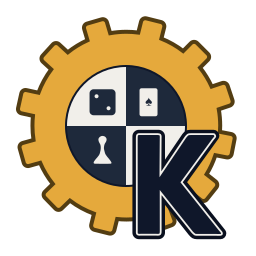

<p align="center">
  
</p>

# Kudchuet

Kudchuet is a Rust framework for building board games, AI engines, and graphical game UIs using `egui`.

It provides:
- a generic board or card game abstraction
- pluggable AI engines (minimax, internal, external UCI engines)
- a modular UI system for rendering boards and pieces
- async AI move computation support
- evaluation and search utilities for game AI

## Live demos

https://www.kudchuet.fr

## Features

### Board game framework
Define any turn-based game by implementing:

- `GUIGame`
- `GUIMove`
- optional rendering traits (`GameDrawer`)
- specific rendering traits (`BoardDrawer`, `SquareDrawer`, `CardDrawer`)

---

### AI system
Kudchuet AI is a fork of https://github.com/edre/minimax-rs
See [here](kudchuet/src/ai/minimax/README.md) for more information.

Kudchuet supports multiple AI backends:

#### Internal engines
- Minimax-based search (using the minimax crate with Iterative deepening and transposition table support)
- Expectiminimax for stractegic games with random parts.

#### External engines (UCI)
- If you provide a move and position serialization/desrialization, you get a simple uci-like server and gui implementation.

### Custom rendering
You can override board rendering using ```BoardDrawer```, ```PieceDrawer``` and ```SquareDrawer```. Default implmentations of those are already really expressive but you can reimplement those and implement really specifc features.
The same stands for override card rendering using ```CardDrawer```

## Example games

Kudchuet includes multiple fully playable example implementations:

### Regular 2 Players Grid Abstract strategy games
- Chess
- Connect Four
- Reversi (Othello)
- Checkers
- Abalone
- Gomoku
- Diaballik
- Yote


### Non Grid Board games
- Awale

### Asymmetric games
- Bagh-Chal
- Hare and Hounds
- Three Musketeers
- Neutron

### Singleplayer games
- Peg Solitaire
- Taquin

### Patience Cards games
- Klondike
- Freecell

### Dice / probabilistic games
- Backgammon

### Multiplayer games
- Chinese Checkers

Each game is implemented using the same `BoardGame` abstraction, and can be used with:
- internal AI engines (minimax / expectiminimax)
- external UCI engines
- the generic `egui` UI system

This makes Kudchuet a unified testbed for board game AI research and experimentation.

